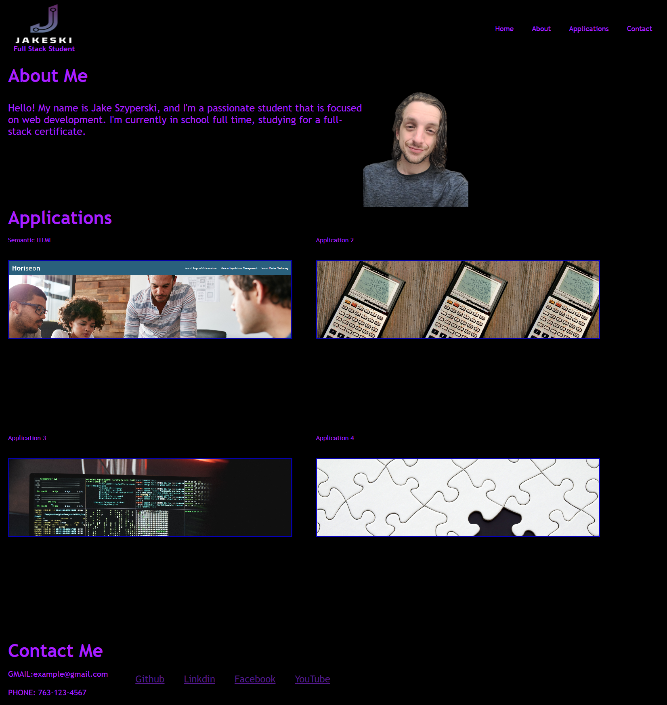

# portfolio-first

# Objectives

- Portfolio showcasing abilities and applications utilizing Javascript, CSS, and HTML.
- Student's Name, including recent photo or avatar
- Links to sections including : About me, Contact, Applications
- Titled images of Applications.
- Images link to deployed Applications
- Responsive Layout Based on Device

# Link to Live Page

\*https://jakeeski.github.io/portfolio-first/

# Screenshot of Portfolio

